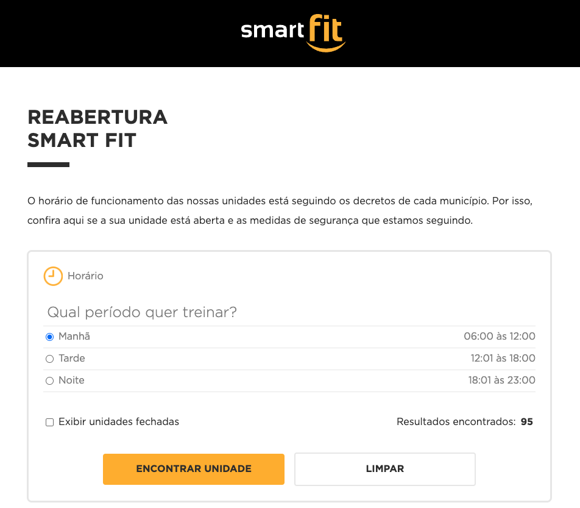
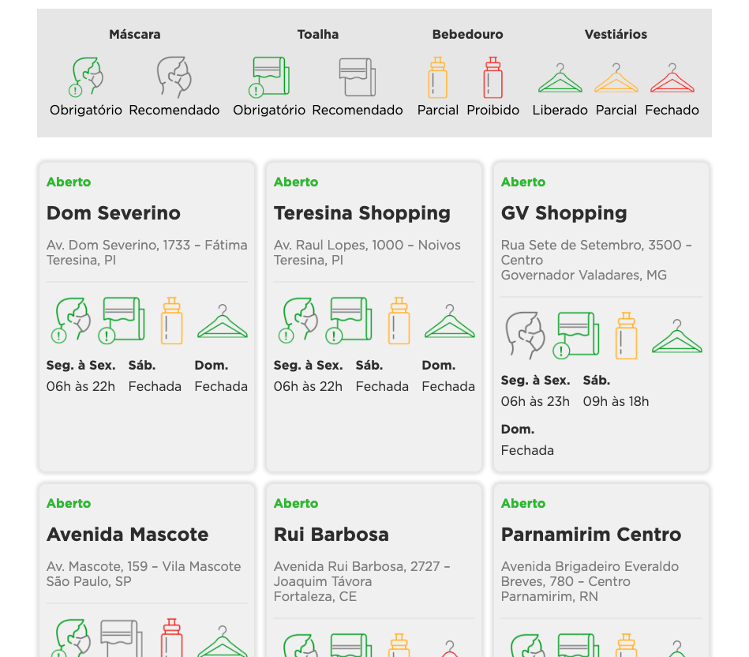
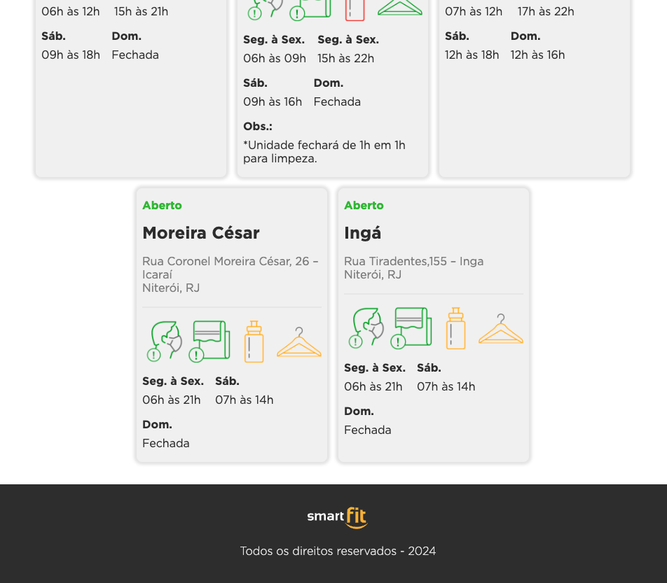
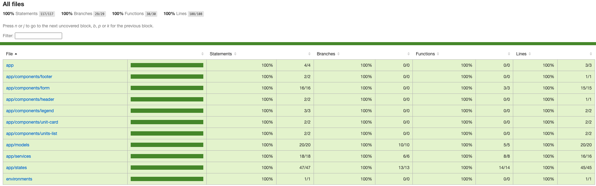

[ANGULAR__BADGE]: https://img.shields.io/badge/angular-%23DD0031.svg?style=for-the-badge&logo=angular&logoColor=white
[TYPESCRIPT__BADGE]: https://img.shields.io/badge/typescript-%23007ACC.svg?style=for-the-badge&logo=typescript&logoColor=white
[JAVASCRIPT__BADGE]: https://img.shields.io/badge/javascript-%23323330.svg?style=for-the-badge&logo=javascript&logoColor=%23F7DF1E
[HTML5__BADGE]: https://img.shields.io/badge/html5-%23E34F26.svg?style=for-the-badge&logo=html5&logoColor=white
[CSS3__BADGE]: https://img.shields.io/badge/css3-%231572B6.svg?style=for-the-badge&logo=css3&logoColor=white
[JASMINE__BADGE]: https://img.shields.io/badge/-Jasmine-%238A4182?style=for-the-badge&logo=Jasmine&logoColor=white
<h1 align="center" style="font-weight: bold;">Desafio Smart Fit</h1>

![Angular][ANGULAR__BADGE]
![TypeScript][TYPESCRIPT__BADGE]
![JavaScript][JAVASCRIPT__BADGE]
![HTML5][HTML5__BADGE]
![CSS3][CSS3__BADGE]
![Jasmine][JASMINE__BADGE]

Esse pequeno projeto contém a solução para o desafio de [Front-end da Smart Fit](https://github.com/bioritmo/front-end-code-challenge-smartsite), utilizando o framework Angular (v18.1) para desenvolver a aplicação.

### Layout

<p align="center">
    
    <span style="margin-right: 16px;"></span>
    
    <span style="margin-right: 16px;"></span>
    
</p>

### Sobre o desafio

A Smart Fit, por atuar no segmento de fitness, passou por várias mudanças na pandemia. Foi necessário desenvolver uma página para buscar unidades fechadas ou abertas para consulta e reserva.

Neste desafio foi implementado as seguintes funcionalidades:

### Funcionalidades
- Carrega dados das unidades através de um arquivo JSON;
- Busca todas as unidades;
- Busca unidades com filtros;
- Mostra previsão de resultados encontrados;
- Mostra unidades ao buscar.

### Regras de negócio
- Filtrar unidades abertas ou fechadas
- Filtrar unidades por período de funcionamento
- Caso não encontre unidades, mostrar uma menssagem ao usuário "Nenhuma unidade encontrada"
- Validar para mostrar ícones corretos de acordo com o status


### Instalação

Esse projeto usa [node](http://nodejs.org), [npm](https://npmjs.com) e [git](https://git-scm.com/), verifique antes se já estão instalados em seu ambiente.

#### Usando API local
Para usar a API localmente será necessário o [json-server](https://github.com/typicode/json-server):
```bash
npm install -g json-server
```
Se usa Linux:
```bash
export NODE_PATH="/usr/lib/node_modules"
```
Se usa Mac com Homebrew:
```bash
export NODE_PATH="/opt/homebrew/lib/node_modules"
```

### Clonando o repositório
```bash
git clone https://github.com/gontranbezerra/desafio-smartfit.git
cd desafio-smartfit
```

### Instalando as dependências
```bash
npm install
```

### Iniciando API local (opcional)
```bash
npm run dev:mock:api
```

### Iniciando a aplicação
```bash
npm run start
```

### Usando a aplicação
No seu navegador vá para `http://localhost:4200/`.

### Testes

```bash
npm run test:coverage
```

Cobertura dos testes:
<p align="left">
    
</p>

Execute `npm run test` para análise dos teste unitários via [Karma](https://karma-runner.github.io).

### Licença

[MIT](LICENSE) © Gontran Bezerra